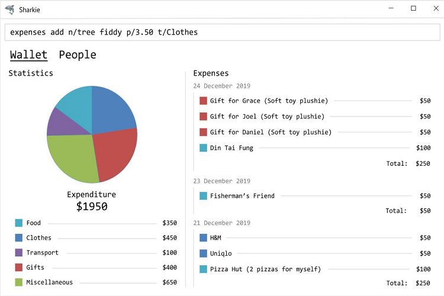

= Sharkie
ifdef::env-github,env-browser[:relfileprefix: docs/]

https://travis-ci.org/AY1920S2-CS2103T-W12-3/main[image:https://travis-ci.org/AY1920S2-CS2103T-W12-3/main.svg?branch=master[Build Status]]
https://coveralls.io/github/AY1920S2-CS2103T-W12-3/main?branch=master[image:https://coveralls.io/repos/github/AY1920S2-CS2103T-W12-3/main/badge.svg?branch=master[Coverage Status]]

ifdef::env-github[]

endif::[]

ifndef::env-github[]
image::images/Ui.png[width="600"]
endif::[]

* Sharkie is an all-in-one desktop application for those who are beginning to see the importance of tracking your money (looking at you, university students).
* Sharkie not only tracks your incomes and expenses - it also acts as a (friendly) loan shark to help you chase down money that your friends owe you.
* They may forget their debts, but Sharkie never will 💰🦈

== Site Map

* <<UserGuide#, User Guide>>
* <<DeveloperGuide#, Developer Guide>>
* <<AboutUs#, About Us>>
* <<ContactUs#, Contact Us>>

== Acknowledgements

* This project was adapted from the AddressBook-Level3 project created by SE-EDU initiative at https://se-education.org
* Some parts of this sample application were inspired by the excellent http://code.makery.ch/library/javafx-8-tutorial/[Java FX tutorial] by
_Marco Jakob_.
* Libraries used: https://openjfx.io/[JavaFX], https://github.com/FasterXML/jackson[Jackson], https://github.com/junit-team/junit5[JUnit5]

== Licence : link:LICENSE[MIT]
