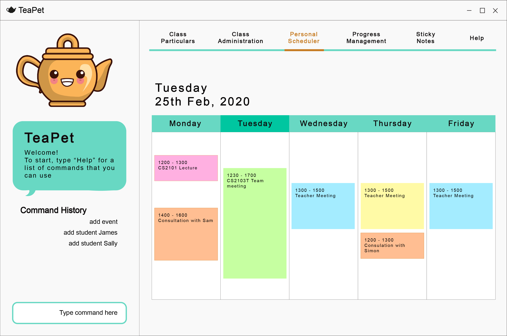

= TeaPet
ifdef::env-github,env-browser[:relfileprefix: docs/]

https://travis-ci.org/se-edu/addressbook-level3[image:https://travis-ci.org/se-edu/addressbook-level3.svg?branch=master[Build Status]]
https://travis-ci.org/AY1920S2-CS2103T-W12-2/main?utm_medium=notification&utm_source=github_status[image:https://ci.appveyor.com/api/projects/status/3boko2x2vr5cc3w2?svg=true[Build status]]
https://coveralls.io/github/se-edu/addressbook-level3?branch=master[image:https://coveralls.io/repos/github/se-edu/addressbook-level3/badge.svg?branch=master[Coverage Status]]
https://www.codacy.com/app/damith/addressbook-level3?utm_source=github.com&utm_medium=referral&utm_content=se-edu/addressbook-level3&utm_campaign=Badge_Grade[image:https://api.codacy.com/project/badge/Grade/fc0b7775cf7f4fdeaf08776f3d8e364a[Codacy Badge]]

ifdef::env-github[]

endif::[]

ifndef::env-github[]
image::images/Ui.png[width="600"]
endif::[]

* TeaPet is an all-in-one desktop program for primary school form teachers to *manage their classroom effectively*.
It manages your *personal curriculum schedule*, *student particulars*, and can also *track your class progress* all in
one simple program.
* TeaPet flexes its simple and clean Graphical User Interface (GUI)
* TeaPet is optimized for those who prefer to work with a *Command Line Interface (CLI)* while still having a simple
and clean Graphical User Interface (GUI).

== Site Map

* <<UserGuide#, User Guide>>
* <<DeveloperGuide#, Developer Guide>>
* <<AboutUs#, About Us>>
* <<ContactUs#, Contact Us>>

== Acknowledgements

* Some parts of this sample application were inspired by the excellent http://code.makery.ch/library/javafx-8-tutorial/[Java FX tutorial] by
_Marco Jakob_.
* Libraries used: https://openjfx.io/[JavaFX], https://github.com/FasterXML/jackson[Jackson], https://github.com/junit-team/junit5[JUnit5]
* Morphed original source code from AddressBook-Level3 project created by SE-EDU initiative at https://se-education.org

== Licence : link:LICENSE[MIT]
